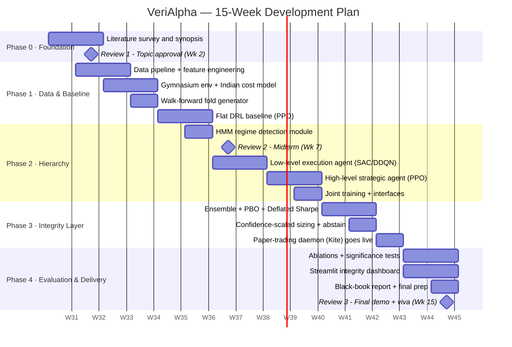

# Project Synopsis (Review 1 Document)

> Prepared as per MPSTME Capstone Project Guidelines — Review 1: Topic approval and feasibility (Week 2).
> Team: 2–3 students | Type of project: **Research + Product**

---

## 1. Title

# **VeriAlpha**
### A Regime-Aware Hierarchical Reinforcement Learning Trading System with Built-in Backtest Integrity Certification

*Short name: VeriAlpha — "Verified Alpha". The system does not just learn to trade; it proves — statistically and with live evidence — that its performance is real and not an artifact of overfitting.*

---

## 2. Overview

Financial markets are non-stationary: strategies that work in one regime (bull, bear, sideways, high-volatility) fail in another. Existing RL trading systems use a single agent for both strategy and execution, and — critically — validate themselves with a single backtest, which published research shows produces mostly false positives (≈9 of 10 retail F&O traders in India lose money; most published RL trading results fail to replicate live).

**VeriAlpha** addresses both problems with a two-layer hierarchical RL architecture wrapped inside an *integrity pipeline*:

- A **High-Level Strategic Agent** (PPO, Options framework) detects the market regime, selects a trading strategy option (trend-following / mean-reversion / defensive-cash / breakout), and sets a capital-allocation and risk budget — scaled by its own **confidence**, including allocating **zero** (abstaining) in unrecognized regimes.
- A **Low-Level Execution Agent** (SAC/DDQN) executes the target position within the window, minimizing slippage and transaction cost under a realistic Indian-market cost model (brokerage, STT, square-root market impact).
- A **Certification Pipeline** — walk-forward folds with purged splits, ensemble training, Probability of Backtest Overfitting (PBO), and Deflated Sharpe Ratio — automatically **rejects** overfit agent candidates before they are promoted.
- A **Live Paper-Trading Daemon** (Zerodha Kite sandbox on NIFTY constituents) records live-vs-backtest divergence as a first-class result, displayed on a Streamlit **Integrity Dashboard**.

### System Overview Diagram

```
             ┌─────────────────────────────────────────────────────┐
             │                DATA & FEATURE SERVICE                │
             │  NSE/NIFTY OHLCV (daily + minute) · yfinance/Kite    │
             │  Indicators: RSI MACD EMA ATR ADX BBands · VIX       │
             └──────────────────────────┬──────────────────────────┘
                                        ▼
             ┌─────────────────────────────────────────────────────┐
             │           MARKET REGIME DETECTION (HMM)              │
             │  Regime probabilities + change-point confidence      │
             └──────────────────────────┬──────────────────────────┘
                                        ▼
   ┌────────────────────────────────────────────────────────────────────┐
   │  HIGH-LEVEL STRATEGIC AGENT (PPO / Options framework, every N bars)│
   │  • Strategy option: trend / mean-rev / defensive / breakout        │
   │  • Capital allocation ∈ {0,10,25,50,75}% — confidence-scaled       │
   │  • Volatility budget · regime-conditioned option termination β(s)  │
   └───────────────────────────────┬────────────────────────────────────┘
                 target position + │ conditioning context
                                   ▼
   ┌────────────────────────────────────────────────────────────────────┐
   │  LOW-LEVEL EXECUTION AGENT (SAC/DDQN, every bar)                   │
   │  • Order size fraction · timing/wait · stop-loss management        │
   │  • Reward: −slippage −txn cost −inventory risk  (NOT PnL)          │
   └───────────────────────────────┬────────────────────────────────────┘
                                   ▼
             ┌─────────────────────────────────────────────────────┐
             │        PORTFOLIO ENGINE + INDIAN COST MODEL          │
             │   brokerage + STT + slippage + √-impact model        │
             └───────────┬─────────────────────────┬───────────────┘
                         ▼                         ▼
   ┌───────────────────────────────┐   ┌───────────────────────────────┐
   │   CERTIFICATION PIPELINE       │   │   LIVE PAPER-TRADING DAEMON   │
   │ walk-forward purged folds ·    │   │  Zerodha Kite sandbox ·       │
   │ ensemble · PBO test ·          │   │  every decision logged with   │
   │ Deflated Sharpe · REJECT       │   │  confidence + regime label    │
   │ overfit candidates             │   │  → live-vs-backtest divergence│
   └───────────────┬───────────────┘   └───────────────┬───────────────┘
                   └───────────────┬───────────────────┘
                                   ▼
             ┌─────────────────────────────────────────────────────┐
             │        STREAMLIT INTEGRITY DASHBOARD                 │
             │  Portfolio view · Agent-brain view (regime,          │
             │  confidence, sizing rationale) · Integrity view      │
             │  (deflated metrics, rejected agents, divergence)     │
             └─────────────────────────────────────────────────────┘
```

---

## 3. Objectives of the Project

1. **Design and implement a two-level hierarchical RL trading system** — a PPO-based strategic agent (regime-aware strategy selection and capital allocation) coordinating a SAC/DDQN execution agent (cost-optimal order execution) — on Indian equity data (NIFTY universe).

2. **Develop confidence-aware capital allocation with an explicit abstain policy**, where ensemble disagreement scales position size down to zero in unrecognized market regimes, measurably reducing maximum drawdown versus always-invested baselines.

3. **Build an automated backtest-integrity certification pipeline** — rolling walk-forward validation with purged folds, Probability of Backtest Overfitting testing, and Deflated Sharpe Ratio reporting — that automatically rejects overfit agent candidates before deployment.

4. **Deploy and continuously run a live paper-trading engine** (Zerodha Kite sandbox) that logs every decision with its regime label and confidence, and quantifies live-vs-backtest performance divergence as a primary evaluation result.

5. **Demonstrate, via ablation studies**, that (a) hierarchical decomposition outperforms a flat DRL agent, (b) regime-conditioned switching outperforms fixed-interval switching, and (c) the abstention policy improves risk-adjusted returns (Sharpe, Sortino, Calmar, MaxDD, CVaR) — with statistical significance (Jobson–Korkie test, bootstrap CIs).

---

## 4. Tools and Techniques

| Category | Tools / Techniques |
|---|---|
| Language | Python 3.11 |
| RL frameworks | Stable-Baselines3 (PPO, SAC), custom Dueling DDQN in PyTorch, Gymnasium custom environments |
| Hierarchical RL | Options framework with regime-conditioned termination β(s); separated reward objectives per level |
| Regime detection | Gaussian HMM (`hmmlearn`) primary; change-point confidence; K-Means/GMM comparison |
| Data | yfinance / NSE bhavcopy (historical daily), Zerodha Kite Connect (minute bars + live paper trading), FRED (India VIX / macro) |
| Feature engineering | Pandas, NumPy, `ta` / TA-Lib (RSI, MACD, EMA, ATR, ADX, Bollinger, OBV, Stoch-RSI, VWAP) |
| Validation & statistics | Rolling walk-forward with purged folds; Probability of Backtest Overfitting (CSCV); Deflated / Probabilistic Sharpe Ratio (Bailey & López de Prado); Jobson–Korkie test with Memmel correction; block-bootstrap confidence intervals |
| Cost modelling | Fixed bps spread + STT/brokerage + square-root market-impact law |
| Storage | SQLite (dev) → PostgreSQL/TimescaleDB (live daemon); MLflow for experiment tracking |
| Dashboard | Streamlit + Plotly |
| Engineering | Git/GitHub, pytest, GitHub Actions CI, Docker (optional) |

---

## 5. Project Engagement Schedule — 15-Week Gantt Chart

Aligned with the MPSTME review timeline: **Review 1 (Week 2)** · **Review 2 (Week 7)** · **Review 3 (Week 15)**. Fortnightly mentor reviews throughout (log book maintained weekly).



### Week-by-Week Table (for the log book)

| Week | Phase | Tasks | Deliverable / Review |
|---|---|---|---|
| 1 | Foundation | Literature survey (15+ papers: HRT, EarnHFT, ELTRA, HARLF, PBO); finalize universe (NIFTY 50 + sector ETFs, daily bars) | Synopsis draft |
| 2 | Foundation | Feasibility analysis; Gantt; presentation | **Review 1 — Topic approval** |
| 3 | Data & Baseline | Data ingestion (yfinance/bhavcopy), indicator pipeline, leakage-safe normalization | Data pipeline v1 |
| 4 | Data & Baseline | Gymnasium trading env; Indian cost model (bps + STT + √-impact); walk-forward fold generator | Env + folds, unit tests |
| 5 | Data & Baseline | Flat PPO baseline agent; buy-and-hold + MA-crossover baselines | Baseline results table |
| 6 | Hierarchy | HMM regime detector; regime-stratified evaluation of baselines | Regime module |
| 7 | Hierarchy | Interim report; midterm presentation (≥40–50% implementation shown) | **Review 2 — Midterm** |
| 8 | Hierarchy | Low-level execution agent trained in isolation vs. cost model (slippage benchmark) | Execution agent v1 |
| 9 | Hierarchy | High-level strategic agent (options, switching-cost reward, differential Sharpe) | Strategic agent v1 |
| 10 | Hierarchy | Level interfaces; warm-start + joint training; regime-conditioned termination | Full hierarchy v1 |
| 11 | Integrity | Ensemble training (N seeds); PBO test; Deflated Sharpe reporting; candidate rejection gate | Certification pipeline |
| 12 | Integrity | Confidence-scaled sizing + abstain policy; **paper-trading daemon live on Kite sandbox** | Live daemon running |
| 13 | Evaluation | Ablation studies (flat vs. hier; ±regime conditioning; ±abstention); Jobson–Korkie, bootstrap CIs | Ablation tables |
| 14 | Evaluation | Streamlit dashboard (portfolio / agent-brain / integrity views); live divergence report | Dashboard v1 |
| 15 | Delivery | Black-book report (per A.8 format), final presentation, demo rehearsal | **Review 3 — Final + Viva** |

---

## 6. Expected Outcomes

- A working hierarchical RL trading system on NSE data, with every component ablated and statistically tested.
- A reusable certification pipeline demonstrating rejection of overfit strategies (target: show ≥1 candidate agent rejected by PBO gate that a naive backtest would have accepted).
- ≥3 weeks of live paper-trading logs with quantified live-vs-backtest divergence.
- Capstone report per MPSTME format; codebase suitable for extension into a startup product (algo-integrity certification under SEBI's 2026 retail-algo framework).

## 7. Latest References (for Topic Approval Form A.2)

1. Zhao, Welsch, "Hierarchical Reinforced Trader (HRT): A Bi-Level Approach for Optimizing Stock Selection and Execution", arXiv:2410.14927, 2024.
2. Qin et al., "EarnHFT: Efficient Hierarchical Reinforcement Learning for High-Frequency Trading", AAAI, arXiv:2309.12891, 2023.
3. Rocchi, "Streamlined Hierarchical Reinforcement Learning for Algorithmic Trading", SSRN 5458097, 2025.
4. "HARLF: Hierarchical Reinforcement Learning and Lightweight LLM-Driven Sentiment Integration for Financial Portfolio Optimization", arXiv:2507.18560, 2025.
5. Bailey, López de Prado, "The Deflated Sharpe Ratio: Correcting for Selection Bias, Backtest Overfitting and Non-Normality", Journal of Portfolio Management, 40(5), 2014.
6. Liu et al., "Deep Reinforcement Learning for Cryptocurrency Trading: Practical Approach to Address Backtest Overfitting", arXiv:2209.05559, 2022.
7. Moody, Saffell, "Learning to Trade via Direct Reinforcement", IEEE Trans. Neural Networks, 12(4), 2001 (differential Sharpe ratio).
8. SEBI, "Safer participation of retail investors in Algorithmic trading", Circular SEBI/HO/MIRSD/MIRSD-PoD/P/2025/13, Feb 2025.
