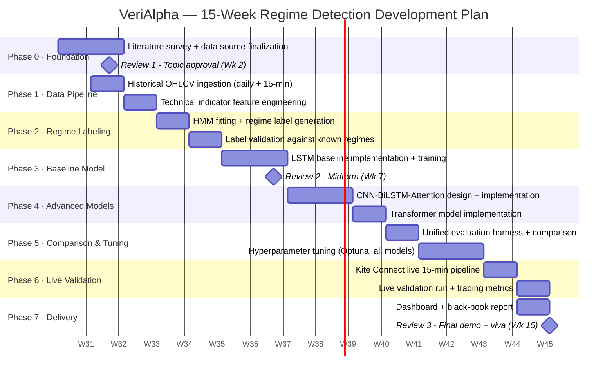

# VeriAlpha — Overview, Tools & Techniques, 15-Week Gantt Chart

Scoped to match the current objectives (Slide 3 / [07_Objectives.md](07_Objectives.md)): an AI-based market regime detection system for Nifty 50, comparing CNN-BiLSTM-Attention, LSTM, and Transformer classifiers trained on HMM-derived regime labels, hyperparameter-tuned and validated live on 15-minute data.

---

## 1. Overview

### 1.1 Problem Statement

Financial markets continuously move between distinct regimes — **bull, bear, sideways, and high-volatility** — and each regime rewards a different trading behavior. A model or strategy trained without awareness of the current regime generalizes poorly: patterns that work in a calm bull market often actively hurt performance in a volatile bear market.

Existing research on this splits into two disconnected groups:

- **Regime-detection papers** (Gaussian HMM studies, regime-aware LightGBM) produce accurate market-state labels, but stop there — they never test whether that regime knowledge actually improves trading outcomes.
- **Trading/RL papers** assume a fixed strategy or embed market conditions only loosely, with no dedicated, validated regime classifier behind the decision.

Critically, **no existing study rigorously compares modern deep sequence architectures — CNN-BiLSTM-Attention, LSTM, and Transformer — head-to-head for regime classification on Indian markets**, or validates the winner on live data using both classification accuracy and real trading performance. That is the gap this project closes.

### 1.2 Proposed Solution

```
        Historical Nifty 50 OHLCV + Technical Indicators
                          │
                          ▼
        Feature Engineering (RSI, MACD, EMA, ATR, ADX,
             Bollinger Bands, OBV, Stochastic RSI, VWAP)
                          │
                          ▼
        Hidden Markov Model (HMM) — unsupervised regime labeling
           Bull  ·  Bear  ·  Sideways  ·  High-Volatility
                          │
                          ▼
   ┌───────────────────────────────────────────────────────┐
   │      Deep Learning Regime Classifiers — compared        │
   │   CNN-BiLSTM-Attention   │   LSTM   │   Transformer     │
   └───────────────────────────────────────────────────────┘
                          │
                          ▼
              Hyperparameter Tuning (Optuna)
        optimized for regime accuracy AND trading performance
                          │
                          ▼
             Best Model Selected (validation set)
                          │
                          ▼
        Live Validation — 15-minute Nifty 50 data (Kite Connect)
        • Classification metrics: accuracy, F1, confusion matrix
        • Trading metrics: Sharpe, cumulative return, drawdown
```

The pipeline has four stages, matching the four project objectives:

1. **Label the market, don't guess it.** An HMM is fit on historical OHLCV + indicator data to produce regime labels in an unsupervised way — this becomes the ground-truth signal for everything downstream, avoiding hand-picked or arbitrary regime definitions.
2. **Let three architectures compete.** CNN-BiLSTM-Attention, plain LSTM, and a Transformer encoder are each trained to predict the HMM regime label from a rolling window of market data, under identical splits and metrics — a fair, direct comparison the literature currently lacks.
3. **Tune for what matters.** Hyperparameters are optimized not just for classification accuracy, but for the trading performance the regime signal produces downstream — a model that classifies well but trades badly is not the goal.
4. **Prove it live.** The winning model is deployed on real 15-minute Nifty 50 data and judged on both fronts — how accurately it labels the regime, and how well a simple regime-conditioned strategy performs using its signal — closing the loop that pure classification papers leave open.

---

## 2. Tools and Techniques

| Category | Tools / Techniques |
|---|---|
| Language | Python 3.11 |
| Historical data | yfinance / NSE bhavcopy — daily and 15-minute Nifty 50 OHLCV |
| Live data | Zerodha Kite Connect — live 15-minute OHLCV feed (websocket + historical REST) |
| Feature engineering | Pandas, NumPy, `ta` / TA-Lib — RSI, MACD, EMA, ATR, ADX, Bollinger Bands, OBV, Stochastic RSI, VWAP |
| Regime labeling | Gaussian Hidden Markov Model (`hmmlearn`) — unsupervised state discovery, BIC for state-count selection |
| Deep learning framework | PyTorch |
| Model 1 | LSTM — sequential baseline |
| Model 2 | CNN-BiLSTM-Attention — convolutional feature extraction + bidirectional LSTM + attention weighting |
| Model 3 | Transformer encoder — self-attention over the OHLCV/indicator sequence |
| Hyperparameter tuning | Optuna (Bayesian / TPE search) over learning rate, layers, hidden size, attention heads, dropout |
| Classification evaluation | scikit-learn — accuracy, precision, recall, F1, confusion matrix |
| Trading performance evaluation | Custom backtester — Sharpe, Sortino, Calmar, max drawdown, cumulative return, on a simple regime-conditioned strategy |
| Validation methodology | Time-ordered (walk-forward) train/validation/test split — no shuffling, no look-ahead |
| Experiment tracking | MLflow — logs every run's config, metrics, and artifacts |
| Dashboard | Streamlit + Plotly |
| Engineering | Git/GitHub, pytest, GitHub Actions CI |

---

## 3. 15-Week Development Plan (Gantt Chart)

Aligned to the review timeline: **Review 1 (Week 2)** · **Review 2 (Week 7)** · **Review 3 (Week 15)**.



### Week-by-Week Table (for the log book)

| Week | Phase | Tasks | Deliverable / Review |
|---|---|---|---|
| 1 | Foundation | Literature survey (regime detection + deep sequence models, ≥15 references); finalize Nifty 50 universe and data sources | Synopsis draft |
| 2 | Foundation | Feasibility analysis, Gantt chart, Review 1 presentation | **Review 1 — Topic approval** |
| 3 | Data Pipeline | Ingest historical daily + 15-minute Nifty 50 OHLCV (yfinance/bhavcopy) | Raw data pipeline |
| 4 | Data Pipeline | Build technical indicator features; time-ordered train/val/test split (no shuffling, no leakage) | Feature pipeline + unit tests |
| 5 | Regime Labeling | Fit Gaussian HMM on training data; generate regime labels (bull/bear/sideways/high-vol) | Labeled dataset v1 |
| 6 | Regime Labeling | Validate HMM labels against known historical regimes (2020 crash, 2022 bear); finalize label quality | Validated regime labels |
| 7 | Baseline Model | LSTM baseline trained on HMM-labeled data; interim report | **Review 2 — Midterm** |
| 8 | Advanced Models | CNN-BiLSTM-Attention architecture design and implementation | Model 2 v1 |
| 9 | Advanced Models | CNN-BiLSTM-Attention training and initial evaluation | Model 2 results |
| 10 | Advanced Models | Transformer encoder implementation and training | Model 3 results |
| 11 | Comparison & Tuning | Unified evaluation harness; classification metrics comparison across all three models | Comparison table v1 |
| 12 | Comparison & Tuning | Hyperparameter tuning (Optuna) for all three models, optimizing accuracy + downstream trading performance | Tuned models |
| 13 | Live Validation | Best model selected; Kite Connect live 15-minute data pipeline built | Live pipeline |
| 14 | Live Validation | Live validation run; compute classification and trading performance metrics; dashboard build | Live results + dashboard v1 |
| 15 | Delivery | Black-book report (per MPSTME format), final presentation, demo rehearsal | **Review 3 — Final + Viva** |

---

## 4. Milestone Summary

| Milestone | Week | Criterion |
|---|---|---|
| Review 1 | 2 | Topic, feasibility, tools, and Gantt approved |
| HMM labels validated | 6 | Regime labels align with known historical market phases |
| Review 2 | 7 | LSTM baseline trained and evaluated; interim report submitted |
| All three models trained | 10 | CNN-BiLSTM-Attention, LSTM, Transformer each produce comparable classification results |
| Best model selected | 12 | Highest-performing tuned model chosen by validation accuracy + trading performance |
| Live validation complete | 14 | ≥1 week of live 15-minute predictions with classification and trading metrics reported |
| Review 3 | 15 | Final report, dashboard demo, and viva |
