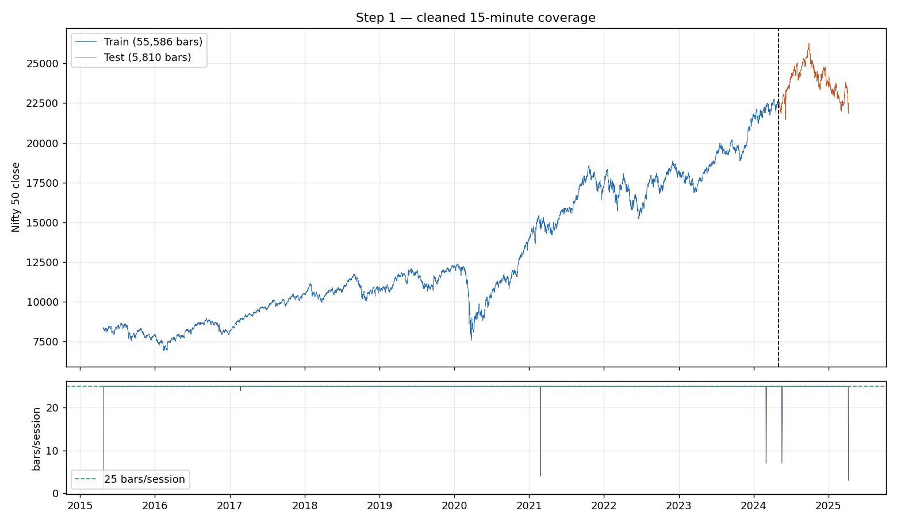

# Step 1 — Data Quality Report

Generated by `scripts/01_prepare_data.py`. Source: `Nifty50_train.csv`, `Nifty50_test.csv` (NSE Nifty 50 index, 15-minute bars).

### train

- Rows in / out: **57,478 -> 55,586**
- Range: **2015-04-23 15:15:00+05:30 -> 2024-04-30 15:15:00+05:30**
- Trading sessions: **2,226**
- Duplicate-timestamp rows dropped: **1,850** across 74 dates
- Special-session rows dropped (Muhurat / live-test): **42** on 10 dates
- OHLC consistency violations: **0**
- Non-positive prices: **0**
- Nulls after cleaning: **none**
- Sessions with < 25 bars: **4**
- Missing intraday bars (holes inside a session): **64**
- Largest single-bar move: **829 bps**
- Shortest sessions: 2015-04-23 (1 bars), 2021-02-24 (4 bars), 2024-03-02 (7 bars), 2017-02-21 (24 bars)

### test

- Rows in / out: **6,014 -> 5,810**
- Range: **2024-05-02 09:15:00+05:30 -> 2025-04-08 09:45:00+05:30**
- Trading sessions: **234**
- Duplicate-timestamp rows dropped: **200** across 8 dates
- Special-session rows dropped (Muhurat / live-test): **4** on 1 dates
- OHLC consistency violations: **0**
- Non-positive prices: **0**
- Nulls after cleaning: **none**
- Sessions with < 25 bars: **2**
- Missing intraday bars (holes inside a session): **40**
- Largest single-bar move: **436 bps**
- Shortest sessions: 2025-04-08 (3 bars), 2024-05-18 (7 bars)

## Split integrity

- Train ends **2024-04-30 15:15:00+05:30**, test starts **2024-05-02 09:15:00+05:30** — strictly chronological, zero overlapping timestamps.

